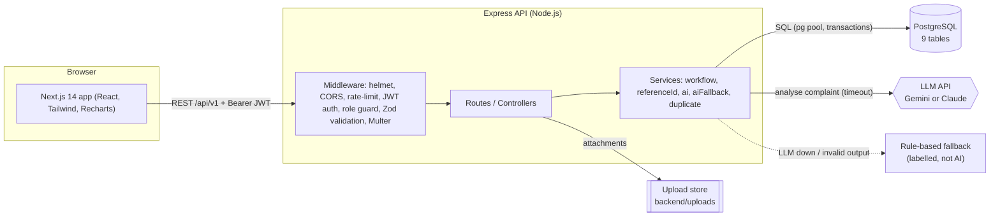
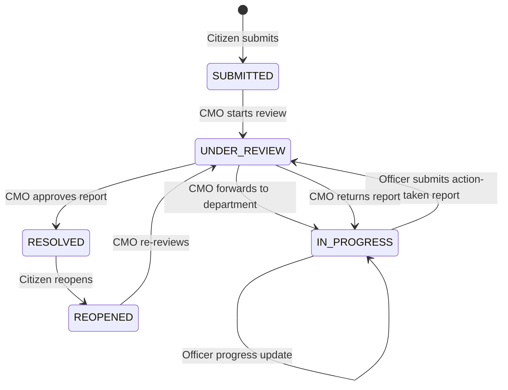

# System Architecture Diagram

```mermaid
flowchart LR
  subgraph Client["Browser"]
    UI["Next.js 14 app (React, Tailwind, Recharts)"]
  end
  subgraph API["Express API (Node.js)"]
    MW["Middleware: helmet, CORS, rate-limit, JWT auth, role guard, Zod validation, Multer"]
    RT["Routes / Controllers"]
    SV["Services: workflow, referenceId, ai, aiFallback, duplicate"]
  end
  DB[("PostgreSQL<br/>9 tables")]
  FS[["Upload store<br/>backend/uploads"]]
  LLM{{"LLM API<br/>Gemini or Claude"}}
  FB["Rule-based fallback<br/>(labelled, not AI)"]

  UI -- "REST /api/v1 + Bearer JWT" --> MW --> RT --> SV
  SV -- "SQL (pg pool, transactions)" --> DB
  RT -- "attachments" --> FS
  SV -- "analyse complaint (timeout)" --> LLM
  SV -. "LLM down / invalid output" .-> FB
```

To export a PNG: paste the code block into https://mermaid.live and download, then save as `system_architecture.png` in this folder.

## Workflow state machine

```mermaid
stateDiagram-v2
  [*] --> SUBMITTED: Citizen submits
  SUBMITTED --> UNDER_REVIEW: CMO starts review
  UNDER_REVIEW --> IN_PROGRESS: CMO forwards to department
  IN_PROGRESS --> IN_PROGRESS: Officer progress update
  IN_PROGRESS --> UNDER_REVIEW: Officer submits action-taken report
  UNDER_REVIEW --> IN_PROGRESS: CMO returns report
  UNDER_REVIEW --> RESOLVED: CMO approves report
  RESOLVED --> REOPENED: Citizen reopens
  REOPENED --> UNDER_REVIEW: CMO re-reviews
```
